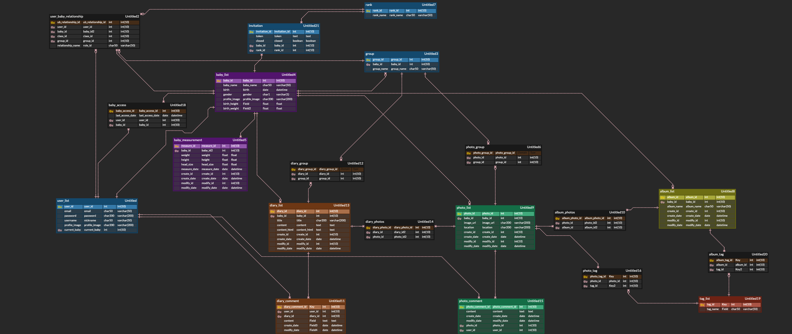

# 👶🏻 Babble

AI 기반 육아 기록 서비스

<br>

## 📆 프로젝트 개요

- **진행 기간**: 2020.08.31 ~ 2020.10.08
- **목표**
  - 내 아이의 성장 기록을 손쉽게 기록하고, 정리할 수 있는 모바일 웹 개발
- **기획서**
  - <a href="documentation/Proposal/육아일기_기획서.pdf">기획안</a>
  - <a href="documentation/Proposal/기획발표피피티.pdf">기획발표 pdf</a>

<br>

## ✍ 프로젝트 소개

> 내 아이의 기록을 스마트하게 남기기, Babble

Babble은 아이의 사진 및 다이어리를 효과적으로 정리해주는 AI 기반의 육아 기록 서비스입니다.

기존 육아 일기 및 육아 앨범 서비스 맘스다이어리, 베베로그는 한 눈에 볼 수 있는 정리된 다이어리나 앨범을 제공하지 않았고, 한 명의 유저만 서비스를 이용할 수 있다는 단점이 있습니다. 또한, 공유할 수 있다고 해도 세부적인 사진 및 다이어리에 대한 권한 관리를 제공하지 않았습니다. 이에 매 번 제각각인 카카오톡 단톡방에 우리 아이 사진을 공유해야 하는 불편함이 존재하고, 그룹별로 (ex. 시댁/친정) 다르게 보여주고 싶은 사진을 손쉽게 관리하기가 쉽지 않았습니다.

그래서 **Babble**은 한 명의 아이에 대한 사진과 성장 기록을 담는 공간인 Babblebox를 제공하며,초대된 유저에게만 사진 및 다이어리를  공유하는 폐쇄형 서비스를 제공합니다. 더불어 사용자에게 차등으로 사진 및 다이어리에 대한 권한을 부여합니다. 배우자와 육아일기를 함께 작성하고, Babblebox에 다른 사람을 초대해 그룹별로 공개하고 싶은 사진, 다이어리, 앨범을 설정할 수 있습니다.

Babble은 `AI`를 활용해 효과적으로 사진 및 앨범을 관리합니다. 사진을 업로드 하면, YOLO 모델과 Deepface 모델을 활용해 자동으로 사물 인식 태그와 감정을 추출하는 태그를 달아줍니다. 또한 태그를 기반으로 앨범 생성이 가능합니다. 원하는 태그를 입력하면 해당 태그가 추출된 모든 이미지를 앨범에 추가해 앨범을 손쉽게 생성할 수 있습니다. 

눈깜짝할 사이에 자라는 아이, Babble에서 아기의 성장기록을 차근차근 작성해보면 어떨까요? Babble이 아이들의 성장과 함께합니다.

<br>

## 🔧 Tech Stack

<details>
    <summary>Front</summary>
    <ul>
        <li>Vue CLI</li>
        <li>Vuex</li>
        <li>Vuetify</li>
        <li>Font Awesome</li>
        <li>Sweet Alert 2</li>
        <li>chart.js</li>
        <li>vue2editor</li>
        <li>Firebase</li>
    </ul>
</details>

<details>
    <summary>Back</summary>
    <ul>
        <li>Django</li>
        <li>MySQL</li>
        <li>Swagger</li>
        <li>E2C</li>
    </ul>
</details>

<br>

## 📝프로젝트 사용법

Babble 시작 방법입니다. 클라이언트 실행방법을 설명해드립니다.

### Frontend

1. Install NPM packages

```bash
cd vue_front
npm i
```

2. Run server

```
npm run server
```

<br>

### Backend

1. 가상환경 실행 후 진행
2. Install packages

```bash
# 가상환경 먼저 실행 후 진행
cd django_server
pip install -r requirements.txt
```

3. Migration 진행

```
python manage.py makemigrations
python manage.py migrate
```

4. Run server

```
python manage.py runserver
```

<br>


## ERD

- https://www.erdcloud.com/d/gWqJhsXvpqD9qBvi9



<br>

## ✨주요 기능

- **AI 기반 사진 관리**
  - 사진 업로드 후 YOLO와 Deepface 모델을 이용한 사진 태그 추출
  - 태그를 기반으로 한 앨범 생성 및 사진 정리
  - 감정 태그에 따른 사진 분류
- **일기 작성**
  - 육아일기 작성 및 관리
  - 일기와 함께 이미지를 추가한다면 Photo에 이미지 자동 추가
  - 일기 목록을 포토카드뷰, 타임라인뷰, 캘린더뷰 3 가지 모드로 제공
- **아기의 성장 기록 관리**
  -  몸무게, 신장, 머리둘레 기록 및 관리
  - 한눈에 볼 수 있는 그래프 및 통계 페이지 제공
- **권한 및 그룹 관리**
  - 생성자, 공동양육자, 손님으로 나뉘어진 권한 시스템
  - 외가, 친가, 지인 등 그룹 생성 및 그룹별 사진 및 다이어리에 대한 접근 권한 차등 부여

<br>

## 👪팀원

##### **Seulki Kang**

- 🍺Github: [@cocony12](https://github.com/cocony12)

##### **SunHwan Park**

- 🧙‍♂️Github: [@SunHwan-Park](https://github.com/SunHwan-Park)

##### **Chaewon Shin**  

- 🌮Github: [@chshin0225](https://github.com/chshin0225)

##### **Chae Lin Shin**

- 🍒Github: [@scl2589](https://github.com/scl2589)

##### **SoYun Bang**

- 🥨Github: [@bbangso](https://github.com/bbangso)

##### **Keunwoo Lee**

- 💪Github: [@lkwoo](https://github.com/lkwoo)

<br>

## 🎞 최종산출물

<a href="">최종발표 시연영상</a>
<a href="documentation/Presentation/Babble_presentation.pdf">최종발표 pdf</a>