# 관련서비스_분석

## 육아활동 기록 관련 서비스

### [베베로그](https://apps.apple.com/kr/app/%EB%B2%A0%EB%B2%A0%EB%A1%9C%EA%B7%B8-bebelog-%EC%8A%A4%EB%A7%88%ED%8A%B8%ED%95%9C-%EC%9C%A1%EC%95%84%EC%9D%98-%EC%8B%9C%EC%9E%91/id1356348649)

> 더 쉽고 스마트한 육아 환경을 제공하는 Baby Total Care Service
>
> - 버튼 하나로 기록하는 수유일지
>   - 수유, 이유식, 수면, 배변까지 버튼만 누르면 자동 기록 및 가족과의 공유가 가능합니다.
> - 함께하고 공유하는 공동육아
>   - 소중한 아이의 하루를 손쉽게 기록하고 함께 공유할 수 있는 공동양육자 초대 기능을 이용해보세요.
> - 아기를 위한 All in one
>   - 언제 어디서나 확인 가능한 온습도계, 스마트폰으로 밝기를 조절하는 수유등, 더 스마트한 기능을 베베로그로 경험하세요.
> - 잊지 않고 알려주는 알람 기능
>   - 배고프기 전에, 아프기 전에! 베베로그의 다양한 알람 서비스를 통해 우리 아기에게 편안한 환경을 제공해주세요.

##### 서비스 특징

- IOT 연동 기능
- 공동 양육자 초대 기능
  - 엄마, 아빠, 가족, 베이비시터
- ~~카카오 스토리 연동 기능~~ (있다고 하는데 어디 있는 지 모르겠음)
- 주요 육아활동을 언제 마지막으로 했는 지 빠르게 파악 가능
- **육아와 관련한 다양한 내용을 직관적이고 귀엽게 기록 가능, 디자인이 가장 깔끔한 듯**
- 예방 접종 체크리스트 기능

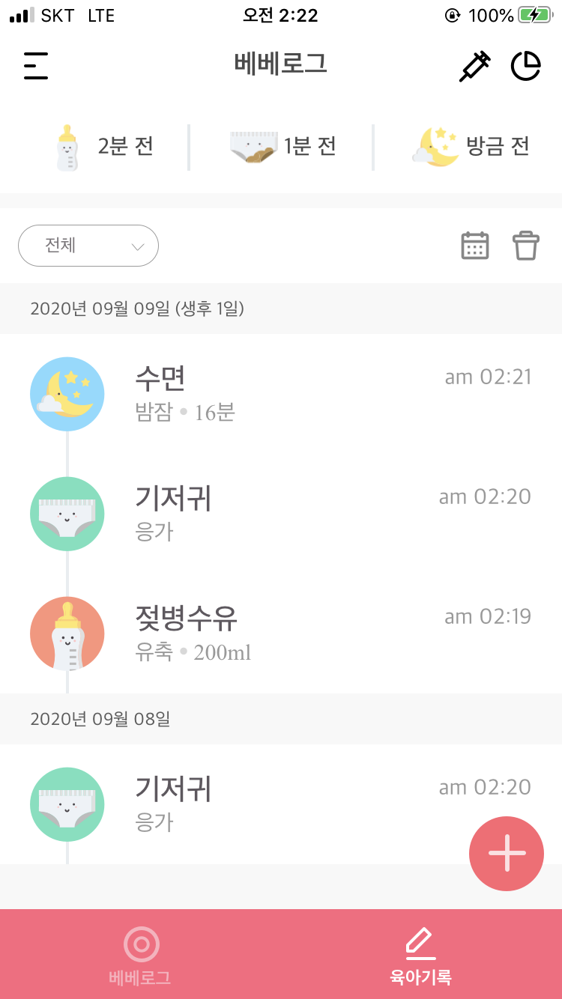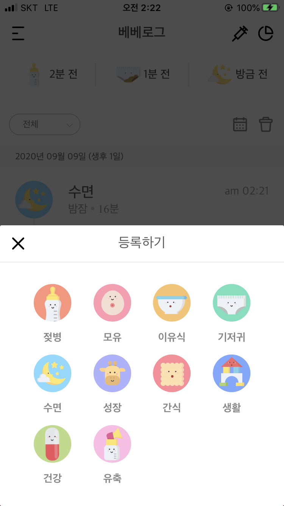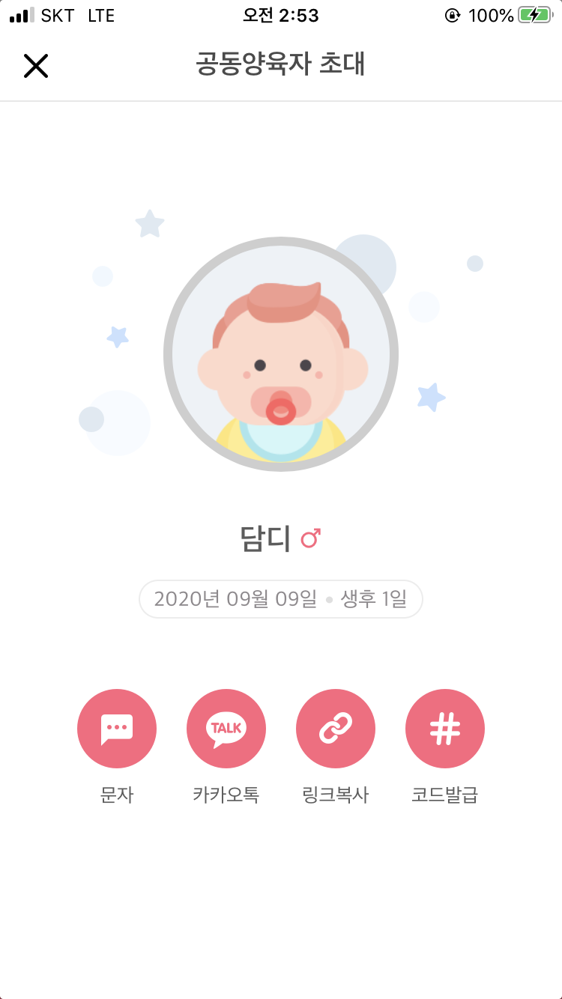

---

### [BabyTime](https://play.google.com/store/apps/details?id=yducky.application.babytime&hl=ko)

> 엄마, 아빠가 함께 기록하는 간편한 올인원 육아 앱
>
> - 아기의 하루하루를 일과표로 쉽게 파악해요
>
> - 아기의 건강 기록 정보를 한눈에 확인해 보세요
>
> - 아기 그룹별로 비교해주는 성장 분석 보고서
>
> - 우는 아기 재울 때 필수! 아기 뮤직 박스
>
> - 육아의 행보과 고충을 함께 나누는 커뮤니티

##### 서비스 특징

- **전체적으로 깔끔한 육아 기록 관리 앱**
- 공동 양육자 초대 기능
- **육아 사항에 대해 비교적 디테일 하게, 하지만 손쉽게 기록 가능**
- 스탑워치 기능 => 시간 편하게 기록 가능
- 아이의 활동 패턴 분석 기능
- 커스텀 통계 그래프 기능
- 공개 일기
  - **몸무게, 키, 머리둘레**와 텍스트, 사진 기록 가능
  - 팔로우 기능은 없음

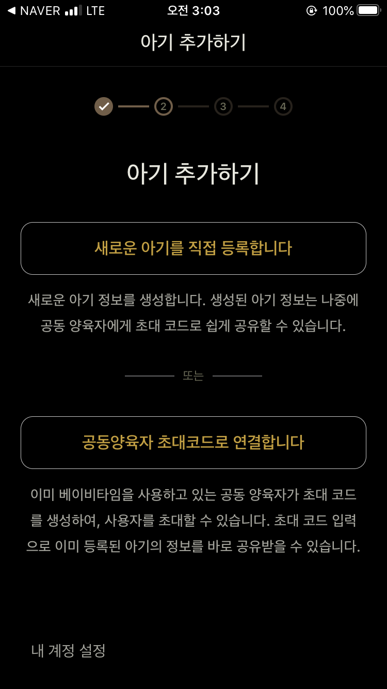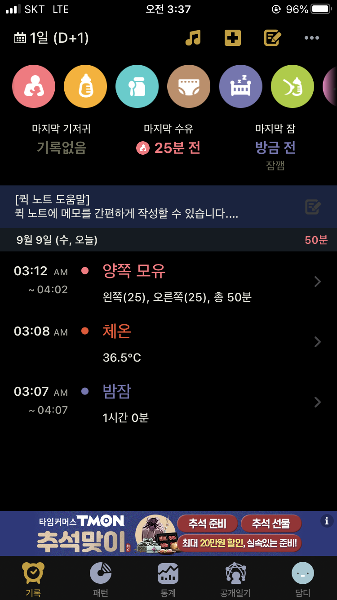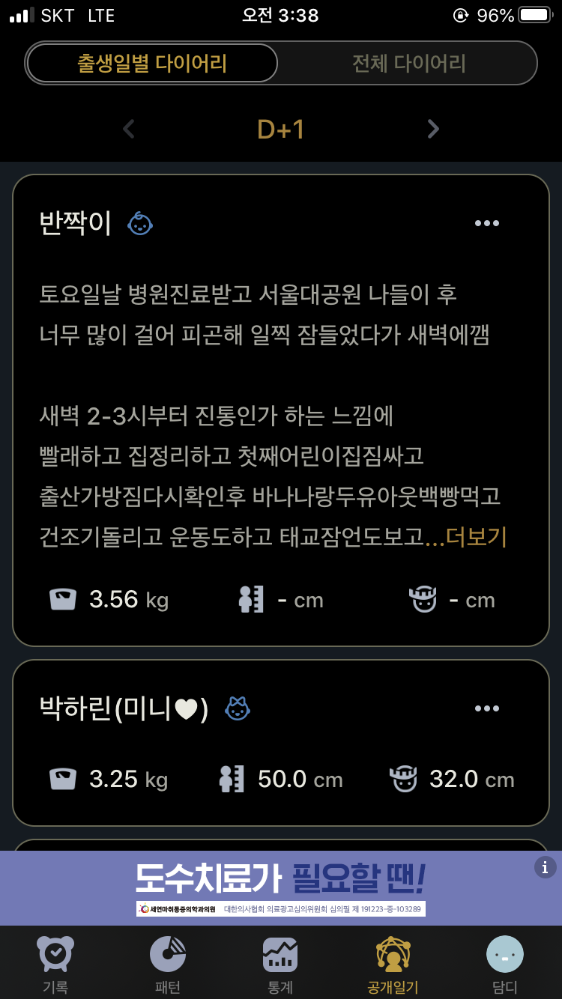

---

## 사진/영상 앨범 관련 서비스

### [i-clip](https://iclip.ai)

> 스마트 사진/음성메모 관리 서비스 - 이미지 캡셔닝, STT 활용
>
> 일상의 사소한 기억을 부담 없이 저장하고 필요하면 언제든지 빠르게 찾을 수 있습니다.
>
> - 다양한 모바일 쿠폰과 상품권을 잊지 않고 사용합니다.
> - 음식 사진을 찍고 칼로리를 확인합니다.
> - 중요한 사진은 메모하여 다이어리처럼 사용합니다.
> - 종이 문서는 사진으로 보관하고 필요할 때 키워드를 통해 검색하여 찾습니다.
> - 처방전/복약지도를 보관하여 보험청구 및 의료정보 필요할 때 활용합니다.

##### 서비스 특징

- **딱 우리가 구현하려는 것을 해준다.** 태깅 작업은 생각보다 잘 되는 것 같다.
- 음성메모도 내용 분석해서 자동 태깅을 해주는데 왜 있는 지 의문
- 사진에서 문서영역인식을 별도로 할 수 있음
- **자르기, 회전, 필터 등 기본적인 사진 편집 가능**
- **태그 활용한 북마크 기능(하나의 태그가 하나의 북마크 역할)**
- **공유하기 => 이미지에 딸려있는 태그가 자동으로 클립보드에 복사됨(이미지와 함께 공유 가능)**

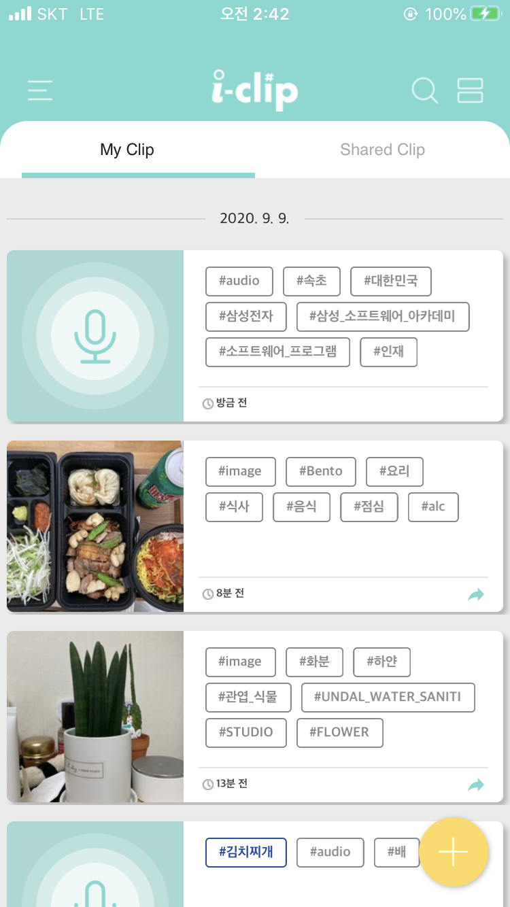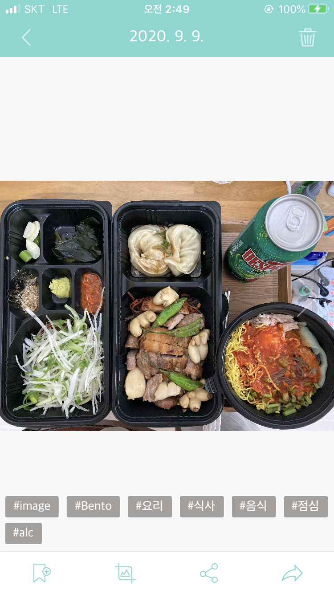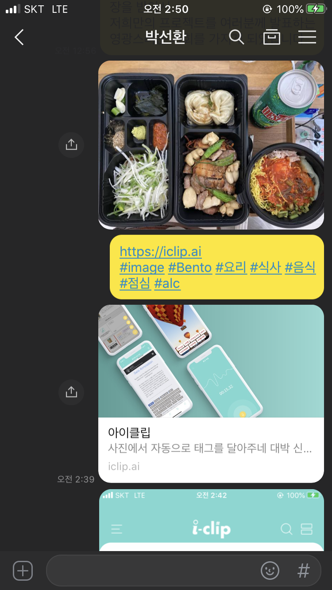

---

### [FamilyAlbum](https://play.google.com/store/apps/details?id=us.mitene&hl=ko)

> 온 가족이 아이의 성장을 기뻐하며 댓글을 주고받을 수 있습니다. 아이의 성장을 언제 어디서나!
>
> - 가족 간의 즐거운 커뮤니케이션 
>   - 초대 받은 가족만이 접근 가능 + 더 디테일한 접근 권한 관리 가능
>   - 사진에 관해 자유롭게 댓글로 소통할 수 있음
>   - 관람 이력 확인 가능
> - 성장 과정을 담은 1초 동영상
>   - 계절별로 패밀리 앨범에 업로드된 사진/동영상을 1초 씩 연결하여 성장 영상을 생성
> - 매달 포토북을 자동 제안

##### 서비스 특징

- 기본적으로 아이폰 기본 앨범과 유사한 느낌 
- **앨범 접근 권한 설정 기능**
  - 부부 이외의 가족이 앨범에 사진 추가할 수 있게/할 수 없게 설정 가능
- **각 사진에 코멘트 달 수 있음**(앨범 접근 가능한 사람끼리 소통 가능)
- **1초동영상, 포토북 등 요약된 컨텐츠 자동 생성**

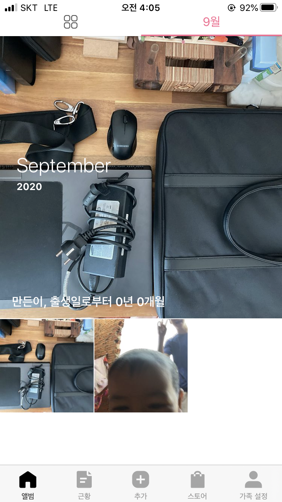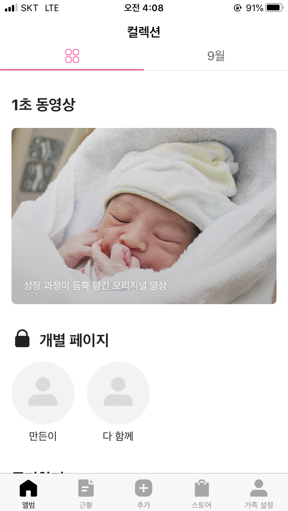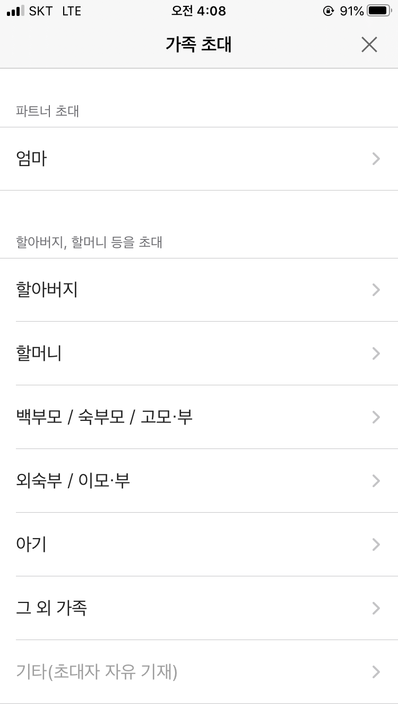